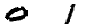
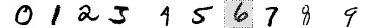
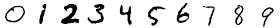
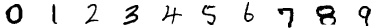
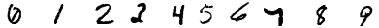
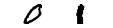
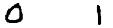

# MNIST Digit Sequence Generator
The goal of this project is to write a program that can generate images representing sequences of numbers, for data augmentation purposes. These images would be used to train classifiers and generative deep learning models. These examples of generated images are helpful in inspecting the characteristics of the generated images and in inspecting the trained models behaviours.

This project uses [MNIST dataset](http://yann.lecun.com/exdb/mnist/) images to generate the image sequence. The MNIST dataset contains 60000 training images and 10000 test images of handwritten digits. 

Though this project focuses only on generating sequence images from MNIST dataset, the code has been written in a way to extend it easily to any general-purpose image sequence generation tasks.

### Problem statement
As mentioned above, image sequences have to be generated from the MNIST handwritten digits images and spacing them accordingly. 

The exact requirements are as follows:

- To generate an image of a sequence, the digits have to be stacked horizontally and the spacing between them should follow a **uniform distribution** over a range determined by two user specified numbers. 

- The numerical values of the digits themselves are provided by the user and each digit in the generated sequence is then chosen randomly from one of its representations in the MNIST dataset. The width of the output image in pixels is specified by the user.

### Implementation
- The problem statement specifies to implement one type of spacing (**random sampling**) and to consider only the spaces **between** digits. I have additionally implemented other spacing types and considered even the edge spaces (before the first digit and after the last digit in the image sequence). The user can set the spacing options in the configuration file as required. The details of the available configurations are discussed below.
- Also, I have added another option to transform the digit images (like blur) before creating the final image sequence. I believe these additional spacing and image transform options will help in generating diverse datasets.
- The technical documentation regarding the implementation (algorithm and the module design) can be found in the [`DESIGN.md`](docs/DESIGN.md) in the `docs/` directory.
- Other information like code assumptions, design decision (tradeoffs), performance and future work are discussed in the [`META.md`](docs/META.md) in the same directory.

### Usage
The project can either be installed as a pip package (API) OR can be run directly using the client script (`client_script.py`) in the repository.

#### 1. Pip package
There are two ways to install this project as a package. They are:
1. pip install from source
    - The project can be installed by downloading the source code (`.zip`), unzip it and then running the following command `pip install .` from the project's root directory. Another option is to run the command `pip install image-sequence-0.0.1.zip` directly without unzipping it.
2. pip install from git repository
    - If the project is hosted on a git repository, the project can be installed by running the following command: `pip install git+<REPO_HTTPS_LINK>`. For private repos, you may need to add the private key and then pip install using the repo's SSH link. Please google for more information.

Once installed, the package can be imported into any 3rd party programs (like an API) as shown below:

**Usage examples:**

***Simple python script to generate digit sequence from DEFAULT configuration***
```python
from image_sequence.generator import DigitSequence


"""
Arguments:
    digits: A list-like containing the numerical values of the digits from which the sequence will be generated (for example [3, 5, 0]).
    spacing_range: a (minimum, maximum) pair (tuple), representing the min and max spacing between digits. Unit should be pixel.
    image_width: specifies the width of the image in pixels.
"""
digits, spacing_range, image_width = range(10), (0, 20), 390

generator = DigitSequence()
gen_image = generator.generate_numbers_sequence(digits, spacing_range, image_width)

# Saves the generated image in the current directory
saved_filepath = generator.save_image(gen_image, digits)
```

***Simple python script to generate digit sequence from CUSTOM configuration***
```python
from image_sequence.generator import DigitSequence

"""
Arguments:
    digits: A list-like containing the numerical values of the digits from which the sequence will be generated (for example [3, 5, 0]).
    spacing_range: a (minimum, maximum) pair (tuple), representing the min and max spacing between digits. Unit should be pixel.
    image_width: specifies the width of the image in pixels.
"""
digits, spacing_range, image_width = range(10), (0, 20), 390
config_filepath = "./api_examples/example_config.json"

generator = DigitSequence(config_filepath)
gen_image = generator.generate_numbers_sequence(digits, spacing_range, image_width)

# Saves the generated image in the current directory
saved_filepath = generator.save_image(gen_image, digits)
```

The output image will have height of 28 pixels and width of `image_width` (from input) and is saved in the directory the code was executed by default (but can give other paths as argument).

An example script (`api_example.py`) and an example config file (`example_config.json`) are added in the `api_examples` directory for reference.

> **NOTE**: Running any script (which imports the package) from the project root directory might import the `image_sequence` module in the project directory rather than the installed package. The results will be the same but just that the code in the module would be used and there would no point installing the package then.

**Package dependencies:**

The package is supported for `Python>=3.5`.

The following modules are required to run the packages. These dependencies are automatically installed during the package installation. So, there is no need for the user to manually install these modules.
```
numpy
Pillow
imgaug
```
The project requires the `Pillow` package to save the generated image and the `imgaug` module ([link](https://github.com/aleju/imgaug)) for digit images transformation. Also, the program uses `cv2` (installed as a dependency for `imgaug`) for image normalization. Please look at the configuration section (or technical docs) for more information regarding image transformation.

#### 2. Client script
- Alternatively, the `client_script.py` file in the repository can be used to generate image sequences. 
- Unlike the package, the dependencies have to be installed manually before running the script. Running the command `pip install -r requirements.txt` from root directory installs all required dependencies.
- Then, the client script can be run using the command: `python client_script.py <SEQUENCE> <MIN_SPACING> <MAX_SPACING> <IMAGE_WIDTH> --config(-c) <CONFIG_FILEPATH>` where:
    - **sequence**: comma-separated sequence of digits to be generated
    - **min spacing**: minimum spacing between consecutive digits
    - **max spacing**: maximum spacing between consecutive digits
    - **image width**: width of the generated image
    - **config filepath** (optional): custom configuration file path

The command `python client_script.py -h` can be run for additional information.

**Usage examples:**

***Default config example:***
Running the following command
```python
python client_script.py 0,1 0 30 86
```
will save an image like this: 

***Custom config example:***
```python
python client_script.py 0,1 0 30 86 -c ./api_examples/example_config.json
```

### Selection of arguments
- For a few sets of arguments, the program will raise an exception with the appropriate reason. Hence, care has to be taken while providing arguments.
- Examples:
    - If the input list has 1 digit and the spacing subtype is set to `between`, the program will raise an error since `between` spacing does not make sense if the list has just 1 digit. This is valid for both `fixed` and `variable` spacing types.
    - If the given spacing type is `fixed` and the available pixels for adding spaces (obtained by subtracting space occupied by the image from image_width) cannot be divided equally among all the available spacings, then the program will generate an error. 
    - For the `fixed` spacing case, even if the available pixels can be divided equally but the value doesnt lie within the spacing range, the program will raise an exception.
- Few arguments are valid for one set of configuration while the same set might not be valid for the other set. Hence, care should be taken while fixing `spacing_range` and `image_width`.
- *Tips*: 
    - If the available space pixels are divisible by both `(num_digits-1)` and `(num_digits+1)`, then that image_width input will support both `edge` and `between` spacing types.
    - Try to avoid having too large spacing ranges for `variable` spacing types since the spacings might be huge between digits and after resizing to the image_width, the digits in the sequence might be squeezed.

### Configuration options
The project generates sequence images based on the provided configuration. These configurations can be written onto a json file and provided as input to the code. If no configuration file is provided, a default configuration (explained below) is used.

The possible config options are:
1. `image`
    - Description: All options related to processing individual digit images goes here.
    1. `transform`:
        - dtype: `bool`
        - Description: This attribute tells whether to transform the individual digit images before adding them in the final sequence image. If set to `true`, a set of transformations are applied to every digit image.
        - Examples:  ,
        
2. `spacing`
    - Description:
        - The `spacing` attribute deals with options related to the spacings between digits in the image sequence.
        - Any digit sequence will have the form `|| DIGIT_1 || DIGIT_2 ||` where `||` represent the possible spacing gaps in the image sequence. Hence, given `n` digits, there can be a maximum of `n+1` spacings (`n-1` spacings inbetween digits and 2 edge spacings) in the final image sequence. Also, the spacing gaps can be of fixed length or varying lengths. The subattributes try to config the spacings depending on the given information.
    1. `type`:
        - dtype: `str`
        - Accepted values: `fixed`, `variable`
        - Description: This attribute tells whether to apply fixed spacing or variable spacing between the digits.
        - Examples:  ,
        
    2. `subtype`:
        - dtype: `str`
        - Accepted values: `edge`, `between`
        - Description: 
            - This attribute is like a suboption to the spacing `type` attribute. Given a spacing type, this attribute tells whether to consider the spacings just between images or even the edge spacings as well.
        - Examples:  ,
        
3. `output_format`:
    - dtype: `str`
    - Accepted values: `png`, `jpg`, `jpeg`
    - Description: This attribute describes the output format of the image. **Note** that saving the image in `jpg` format might reduce the final image_width (in the saved image) since `jpg` uses lossless compression algorithm.

If no config file is provided, the following configuration (default config) will be used:
```json
{
    "image": {
        "transform": false
    },
    "spacing": {
        "type": "variable",
        "subtype": "between"
    },
    "output_format": "png"
}
```

**NOTE:** The problem statement specifies to sample space widths BETWEEN digits from a uniform distribution. Since the `variable` spacing type, `between` spacing subtype and `false` transform satisfies this requirement, this is set as the default configuration.

### Unit testing (for developers)
There are several tests written to test the module.

**Test dependencies:**

The `tox` module is used to run tests in various environments. Currently, the project is configured to be tested in `py35` and `py36` environments.

**Running the tests:**

The test requirements can be installed by running the command `pip install -r requirements_test.txt`.

Once installed, the tests can be run using the command
```
tox
```
from the **project's root directory**.

**Note**: `tox` is very helpful when the project scales and coupled with continuous integration and deployment.

### License
[MIT](LICENSE)

### Project extension
As mentioned in the summary, though this project focuses only on generating digit sequence from MNIST images, the project can be easily extended to generate any image sequence given the dataset and their labels (eg. ImageNet dataset).