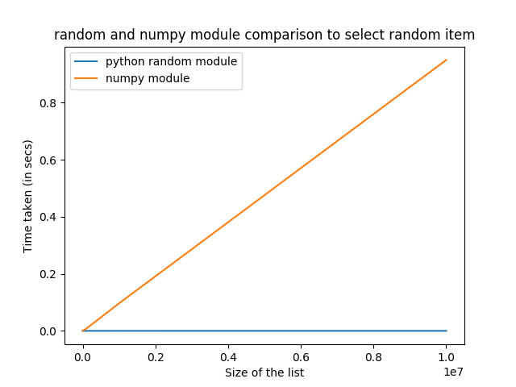

# Code assumptions
The code assumes that it has:
- *read* and *write* permission at the location where package is installed (for loading and saving dataset).
- *write* permission in the location where the generated image is saved.

# Design decisions
1. Storing `grouped_labels` data structure

    The `grouped_labels` data structure (which maps labels to corresponding indices) is stored onto the filesystem in the dataset directory rathan than recreate it (which is time-expensive task) everytime the `DigitSequence` class is initialized. Creating this data structure takes *2.3 secs* on average for 60k-train dataset on a intel core-i5 2.7GHz system. Loading it from the filesystem significantly reduces time. 

2. Pickling vs json for storing the data structure

    - The data structure could be stored either using python `pickle` module (in binary) or using `json`. Pickle has been traditionally known to be relatively slow and insecure. It is possible to inject malicious scripts in the pickled file which when loaded can have unexpected consequences (which is not desired in the production code). 
    - So, I preferred to use json for storing the data structure. JSON is transparent and can be used across languages ([reference](https://www.benfrederickson.com/dont-pickle-your-data/#targetText=Just%20use%20JSON&targetText=Pickle%20on%20the%20other%20hand,data%20they%20can%20write%20out.)).

3. Data structure for `grouped_labels`

    This is a minor tradeoff decision. I was considering two options: dict with label as the key and list of indices as the values and the other is list of lists. I expected the list of lists data structure to perform better for larger dataset since there is overhead of hashing (as in dict) everytime a label's indices needs to be accessed when dict is used ([reference](https://stackoverflow.com/questions/21199685/why-isnt-my-dict-lookup-faster-than-my-list-lookup-in-python/21200525#21200525)).

4. Dealing with errors

    This is another minor tradeoff. There were two options: raising exceptions and the other is hiding the exception and returning `None` (suitable for REST API kind). Since the project is to be used as a package, I went with the former, following the pattern of most pip packages. Also, it helps the user to debug the error accordingly.

5. Module to select random item from a list (minor tradeoff)

    - To select an image for a digit, a random index should be drawn from the list containing all indices with that digit as label. Assume the case with 10 million labels. In that scenario, every list with indices will be huge and so we need to choose a module which can select a random index in the least amount of time with decent performance. I have considered two options: python inbuilt `random` module `choice()` method and the other being the `numpy` module's `choice()` method. 

    - The numpy.choice method's time complexity surprisingly seems to increase with the size of the list while the random module choice method seems to have around constant time complexity. 

# Performance
- For data augmentation problems, it can be said that the time complexity is not crucial (compared to real-time systems) as long as it is in the acceptable range.
- Below are performance measurements for image sequence generation using various configuration parameters.

**System**: 

The numbers were computed based on an intel core-i5 2.7Ghz CPU with 4GB DDR3 memory. That is a rather dated system by today's standards. A modern, high-end system should achieve better performance.

**Experiments and results**

The MNIST train dataset (containing ***60k images***) was used while calculating performance. And the images were generated one at a time i.e. on a single process (without parallelism).

1. The time to initialize the `DigitSequence` class (incl. loading of dataset and `grouped_labels` data structure and excl. download) was found to be around *5.4 secs* on average. If needed, the test dataset could be used for testing purposes. The average time to generate an image with various configs is as follows:
    - config 1: `notransform`, `variable` spacing type, `between` spacing subtype (config mentioned in the problem statement) - *7e-4 secs*
    - config 2: `notransform`, `variable` spacing type, `edge` spacing subtype - *9e-4 secs*
    - config 3: `notransform`, `fixed` spacing type, `between` spacing subtype - *2e-4 secs*
    - config 4: `notransform`, `fixed` spacing type, `edge` spacing subtype - *1.8e-4 secs*
    - config 5: `transform`, `variable` spacing type, `between` spacing subtype - *67e-4 secs*
    - config 6: `transform`, `variable` spacing type, `edge` spacing subtype - *66e-4 secs*
    - config 7: `transform`, `fixed` spacing type, `between` spacing subtype - *66e-4 secs*
    - config 8: `transform`, `fixed` spacing type, `edge` spacing subtype - *66e-4 secs*
2. For a fixed `transform` (set to default config value), the graph compares the time taken for the `fixed` and `variable` spacing types. 
 
3. For a fixed `spacing` param (default config value), the below graph compares the time taken with and without using the `transform` parameter.
 

**Inferences**
1. It can be inferred that the `variable` type takes more time primarily due to the overhead of image resizing after the output image is generated.
2. It can be said that the transform operation seems to reduce the performance significantly due to the additional transformation step and image normalization step. The performance improvements for this case is discussed in the next section.

# Future work
1. **Generating larger datasets**

- At present, the `DigitSequence` class has a method to generate only one image at a time. For generating the large dataset, one option is to use multiprocessing and call the `generate_number_sequence` method in parallel. In this case, the currently followed pattern to save generated filenames needs to be tweaked (like adding uuid to filename) to avoid collision when two processes generate the same digit sequence at the same time.

- The second option is to write a method in `DigitSequence` class which takes the dataset size as input, generates the images and then saves these image arrays into a binary format. Doing so can help in faster loading of datasets for training deep learning models and negates image loading and processing steps.

2. **Unit tests**
- The unit tests are written to the best that I could. I believe the tests are reasonable enough to make sure the errors are captured if the code breaks in the future. 
- I have tried to unittest the code without having any real side-effects (by using mocks and patches) in the filesystem. This has reduced the unittesting time significantly.
- Also, I have used the inbuilt `unittest` module for this project. For larger projects, `pytest` or `nose` could be used.
- *Additional unittest links*: I have written unittests ([link](https://gist.github.com/esh-b/3bc2d3d77bfcd716121ed41525237e4a)) for an email system in Django module (can be referred if necessary).

3. **Performance improvements**
- As discussed above, the performance when the transform is enabled has to be improved. 
- The `imgaug` module seems to have a significant performance increase when a large batch of images are given as input ([reference](https://imgaug.readthedocs.io/en/latest/source/performance.html)). So, one option is to process a large number of inputs and process them together during the transform process. This might increase the performance incase of large datasets. For relatively smaller datasets, running multiple processes for image sequence generation might help. I could not do it now given the time constraint.
- Alternatively, if only a few fixed image transformation techniques are required for our purpose, we could replace this module with a much simpler image processing codebase.

4. **Python version support**

    The package currently supports Python3.5+. But it can be extended to python2.7 with a few changes. The reason for not adding python2.7 support now is that python2.7's support is going to end at the end of this year and not many people are going to use it thereafter. Also, I would like to leverage the useful features in Python3.x (like function annotations, builtin enums, etc).

5. **Professional package**

    The package can be made much more professional (and easy to use) by adding reference docs (using sphinx), uploading the package to PyPI (or equivalent private repos), signing using gpg signatures, etc.

